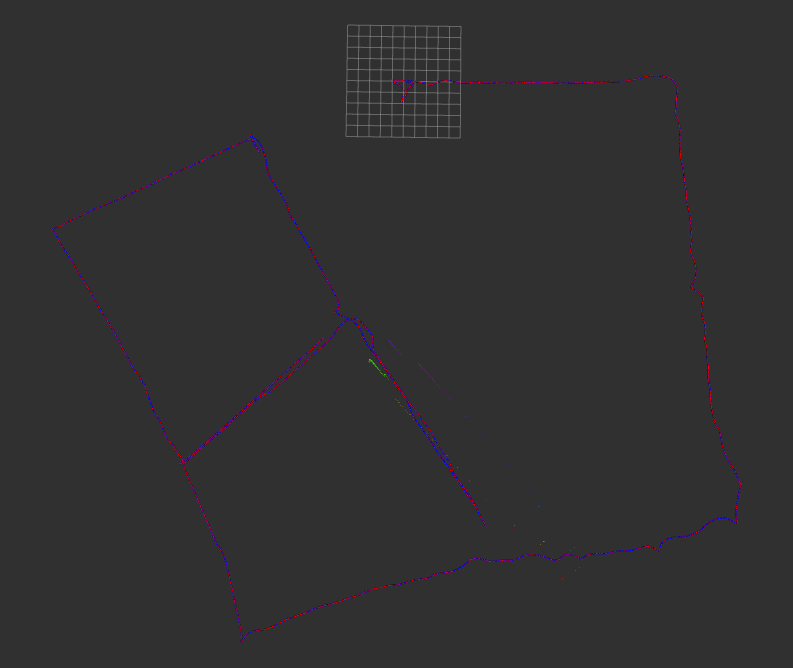
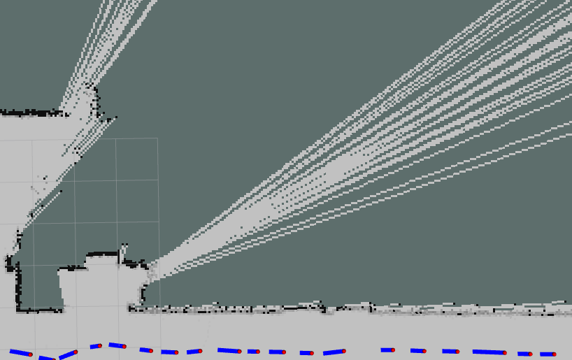

# mrobot
2D激光里程计框架

该激光SLAM框架仅支持2D激光雷达数据


数据预处理模块的需求：

- 订阅原始激光雷达的消息 sensor_msgs::
- 发布激光雷达点云消息(预处理之后的)

不能通过ros的标准格式来进行前端和建图模块的通信了，那前端得到的优化后的位姿和range_readings该如何喂给建图模块呢？

把readings写到txt文件中？


```
visualization_msgs::MarkerArray marray; 的用法
```




### 目前框架的缺陷

#### 前端

- 

#### 后端

- 后端还未从Karto slam中解耦出来

#### 建图

- 建图部分没有根据点云的范围自适应调整地图大小，现在是初始化一个很大的空白地图
- 建图部分加一个保存栅格地图的操作(pgm格式)


未发布map到odom下的坐标转换关系，目前只是前端+建图

没有加入回环

障碍物边界不清晰，有散射的可通行区域


不能适应不同的数据集

- basic_localization_stage_indexed.bag报错
  - LaserRangeScan contains 1081 range readings, expected 1081
  - 这个数据集一共有1081个点


```
Mapper.cpp中出现的
kt_bool LaserRangeFinder::Validate(SensorData *pSensorData) {
  LaserRangeScan *pLaserRangeScan = dynamic_cast<LaserRangeScan *>(pSensorData);

  // verify number of range readings in LaserRangeScan matches the number of
  // expected range readings
  if (pLaserRangeScan->GetNumberOfRangeReadings() !=
      GetNumberOfRangeReadings() - 1) {
    std::cout << "LaserRangeScan contains "
              << pLaserRangeScan->GetNumberOfRangeReadings()
              << " range readings, expected " << GetNumberOfRangeReadings()
              << std::endl;
    return false;
  }

  return true;
}
```





大于60的比例认为是障碍物


小于


40的障碍物概率是 路过两次 击中三次 

路过两次 

pMapHits[i] + pMapMisses[i] == 0       

Gridmap.data[i] = 0表示科通行区域

- 

设置雷达的最大探测距离，这个太长了。大于多少的就丢弃掉

minimum_travel_distance


一定要抓住基于PCL库的点云匹配适合3D激光雷达，但是并不适用于2d的激光雷达匹配。融合难度比较大，目前的开源框架没有这么干的。

总结一下目前2d激光slam在前端计算位姿时用的方法。

介绍一下之前做这个框架的人，为什么用PCL库没啥问题 在点云匹配这一块。


## intel.bag


​																																（GT）


​																			        Mrobot


​																														        	Karto slam


​																														GMapping


​																																GMapping


​																															Karto slam


​																														(Mrobot)


- **geometric** and **photometric** 3D mapping pipeline(better geometric and photometric accuracy )
- real-time hierarchical volumetric neural radiance fields
- 


- geometric accuracy（Depth L1)
- photometric accuracy (PSNR - peak signal-to-noise ratio)  图像质量评估的指标


SLAM为fit a neural radiance field of the scene  提供了

- by providing **accurate pose estimates** and **depth-maps with associated uncertainty.** 
- The estimated poses and depth-maps from dense SLAM, weighted by their marginal covariance estimates, provide the ideal source of information to optimize a hierarchical hash-based volumetric neural radiance field. W


SLAM提供了

- 3D poses
- dense depth-maps,and probabilistic uncertainties


Our Frontend's Pointcloud

**Mesh** Resulting front TSDF Fusion


Ablation Experiments 消融实验

Replica Dataset 副样本数据集(多跑几个场景的实验需要用到)


## 2023.09.27


