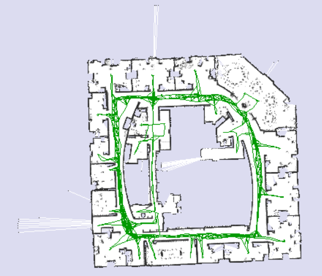
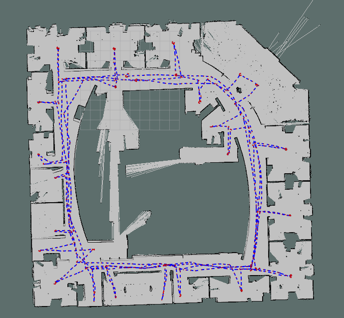
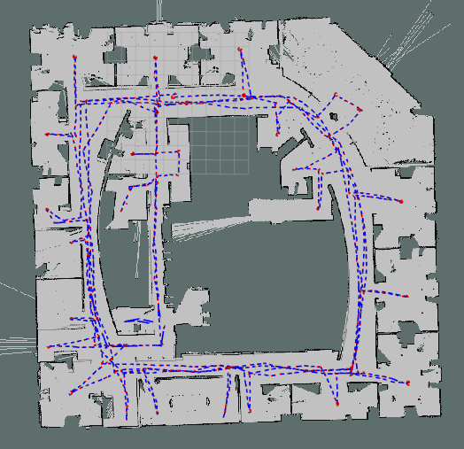
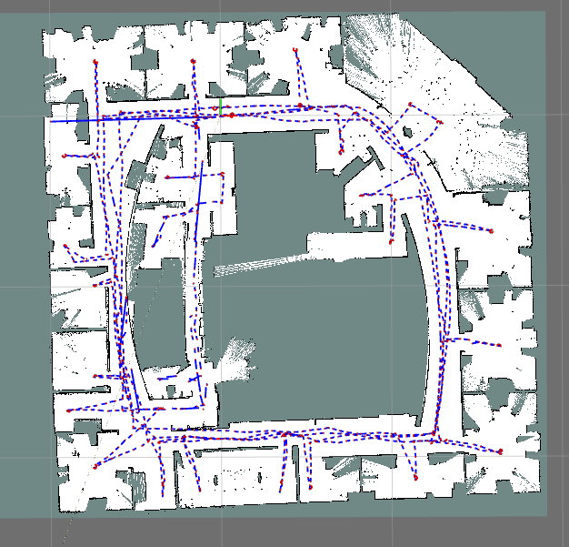
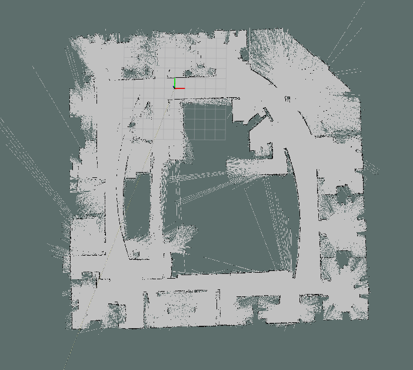
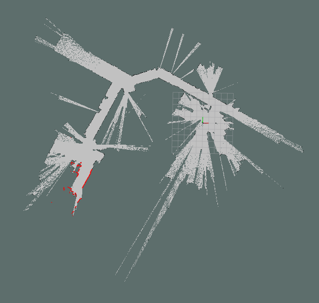
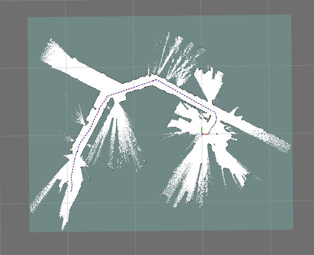
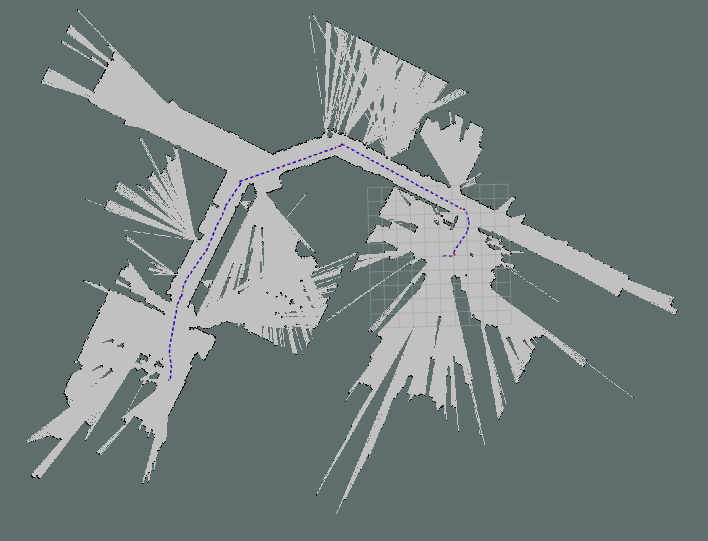
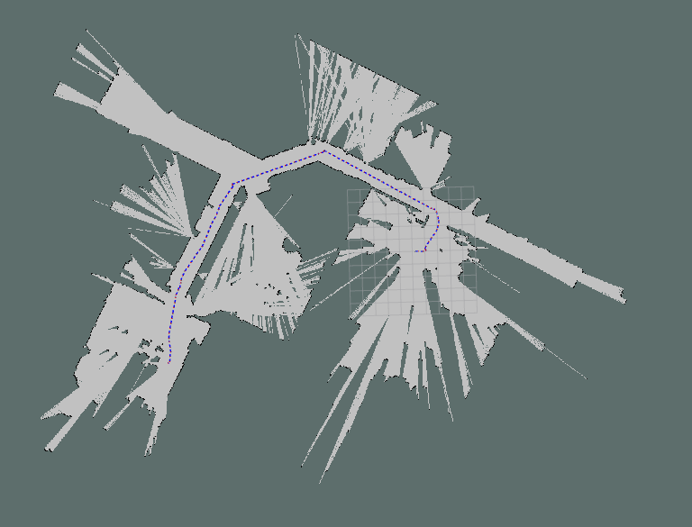

# mrobot
2D激光里程计框架

该激光SLAM框架仅支持2D激光雷达数据


数据预处理模块的需求：

- 订阅原始激光雷达的消息 sensor_msgs::
- 发布激光雷达点云消息(预处理之后的)

不能通过ros的标准格式来进行前端和建图模块的通信了，那前端得到的优化后的位姿和range_readings该如何喂给建图模块呢？

把readings写到txt文件中？


```
visualization_msgs::MarkerArray marray; 的用法
```


### 目前框架的缺陷

#### 前端

- 

#### 后端

- 后端还未从Karto slam中解耦出来

#### 建图

- 建图部分没有根据点云的范围自适应调整地图大小，现在是初始化一个很大的空白地图
- 建图部分加一个保存栅格地图的操作(pgm格式)


未发布map到odom下的坐标转换关系，目前只是前端+建图

没有加入回环

障碍物边界不清晰，有散射的可通行区域


不能适应不同的数据集

- basic_localization_stage_indexed.bag报错
  - LaserRangeScan contains 1081 range readings, expected 1081
  - 这个数据集一共有1081个点


```
Mapper.cpp中出现的
kt_bool LaserRangeFinder::Validate(SensorData *pSensorData) {
  LaserRangeScan *pLaserRangeScan = dynamic_cast<LaserRangeScan *>(pSensorData);

  // verify number of range readings in LaserRangeScan matches the number of
  // expected range readings
  if (pLaserRangeScan->GetNumberOfRangeReadings() !=
      GetNumberOfRangeReadings() - 1) {
    std::cout << "LaserRangeScan contains "
              << pLaserRangeScan->GetNumberOfRangeReadings()
              << " range readings, expected " << GetNumberOfRangeReadings()
              << std::endl;
    return false;
  }

  return true;
}
```


大于60的比例认为是障碍物


小于


40的障碍物概率是 路过两次 击中三次 

路过两次 

pMapHits[i] + pMapMisses[i] == 0       

Gridmap.data[i] = 0表示科通行区域

- 

设置雷达的最大探测距离，这个太长了。大于多少的就丢弃掉

minimum_travel_distance


一定要抓住基于PCL库的点云匹配适合3D激光雷达，但是并不适用于2d的激光雷达匹配。融合难度比较大，目前的开源框架没有这么干的。

总结一下目前2d激光slam在前端计算位姿时用的方法。

介绍一下之前做这个框架的人，为什么用PCL库没啥问题 在点云匹配这一块。


## intel.bag



​																																（GT）




​																			        Mrobot





​																														        	Karto slam



​																														GMapping



​																																GMapping



​																															Karto slam




​																														(Mrobot)




- **geometric** and **photometric** 3D mapping pipeline(better geometric and photometric accuracy )
- real-time hierarchical volumetric neural radiance fields
- 


- geometric accuracy（Depth L1)
- photometric accuracy (PSNR - peak signal-to-noise ratio)  图像质量评估的指标


SLAM为fit a neural radiance field of the scene  提供了

- by providing **accurate pose estimates** and **depth-maps with associated uncertainty.** 
- The estimated poses and depth-maps from dense SLAM, weighted by their marginal covariance estimates, provide the ideal source of information to optimize a hierarchical hash-based volumetric neural radiance field. W


SLAM提供了

- 3D poses
- dense depth-maps,and probabilistic uncertainties


Our Frontend's Pointcloud

**Mesh** Resulting front TSDF Fusion


Ablation Experiments 消融实验

Replica Dataset 副样本数据集(多跑几个场景的实验需要用到)


## 2023.09.27

明确哪里需要日志文件，哪里不用日志文件，


- 先看一下如何将sparse_bundle_adjustment这个模块给换掉，也就是后端给换掉，换成g2o，或者替换成可选项的那种，模仿想哥的
  - 而且需要看能否将后端抽离出来


- 还需要预处理的节点吗？感觉得看kato slam中是如何处理原始点云信息的

- 统一使用智能指针
- 后端和回环感觉还是得用上
- 自适应地图大小肯定要实现的
- 终极目标：去除openc_karto的依赖，并且能够加快编译，尽量不依赖除了Eigen以外的库


​							

## 后端部分

- 依赖了<open_karto/Karto.h>、<open_karto/Mapper.h>
- <sparse_bundle_adjustment/spa2d.h>
- 需不需要看懂karto slam后端接口部分，然后移植到我们的框架中来？
- 后端的接口继承于karto::ScanSolver
  - 主要重写了以下几个函数：~CeresSolver(); Clear();   Compute(); const karto::ScanSolver::IdPoseVector &GetCorrections() const; AddNode AddConstraint


```c++
class ScanSolver
{
public:
    /**
     * Vector of id-pose pairs
     */
    typedef std::vector<std::pair<kt_int32s, Pose2>> IdPoseVector;

    /**
     * Default constructor
     */
    ScanSolver()
    {
    }

    /**
     * Destructor
     */
    virtual ~ScanSolver()
    {
    }

public:
    /**
     * Solve!
     */
    virtual void Compute() = 0;

    /**
     * Get corrected poses after optimization
     * @return optimized poses
     */
    virtual const IdPoseVector &GetCorrections() const = 0;

    /**
     * Adds a node to the solver
     */
    virtual void AddNode(Vertex<LocalizedRangeScan> * /*pVertex*/)
    {
    }

    /**
     * Removes a node from the solver
     */
    virtual void RemoveNode(kt_int32s /*id*/)
    {
    }

    /**
     * Adds a constraint to the solver
     */
    virtual void AddConstraint(Edge<LocalizedRangeScan> * /*pEdge*/)
    {
    }

    /**
     * Removes a constraint from the solver
     */
    virtual void RemoveConstraint(kt_int32s /*sourceId*/, kt_int32s /*targetId*/)
    {
    }

    /**
     * Resets the solver
     */
    virtual void Clear(){};
}; // ScanSolver


MapGrapher类
    

```


```c++
SpaSolver *solver_;
solver_ = new SpaSolver();
mapper_->SetScanSolver(solver_);         #这个地方和open_karto有关吧
    
solver_->getGraph(graph);


karto::ScanSolver                       #这个地方和open_karto有关吧  karto命名空间里面声明了？  karto::ScanSolver基类？
```


```c++
MapperGraph* m_pGraph;         //基类
    

if (m_pUseScanMatching->GetValue()) {
      // add to graph
      m_pGraph->AddVertex(pScan);
      m_pGraph->AddEdges(pScan, covariance);

      m_pMapperSensorManager->AddRunningScan(pScan);

      if (m_pDoLoopClosing->GetValue()) {
        std::vector<Name> deviceNames =
            m_pMapperSensorManager->GetSensorNames();
        const_forEach(std::vector<Name>, &deviceNames) {
          m_pGraph->TryCloseLoop(pScan, *iter);
        }
      }
    }
```


具体在哪里solver了呢

```C++
void MapperGraph::CorrectPoses() {
  // optimize scans!
  ScanSolver *pSolver = m_pMapper->m_pScanOptimizer;
  if (pSolver != NULL) {
    pSolver->Compute();

    const_forEach(ScanSolver::IdPoseVector, &pSolver->GetCorrections()) {
      m_pMapper->m_pMapperSensorManager->GetScan(iter->first)
          ->SetSensorPose(iter->second);
    }

    pSolver->Clear();
  }
}

//调用了上面的CorrectPoses() 
kt_bool MapperGraph::TryCloseLoop(LocalizedRangeScan *pScan,
                                  const Name &rSensorName)
```

karto slam只有检测到回环才会进行优化吗？


- 由于Karto中并没有实现后端的具体求解方法，而是将后端的求解方法定义成立了接口类，以方便后续进行具体的实现．


雷达的数据在远距离的跳动，使得地图生成了更多的**毛刺**

数代表这对雷达数据使用的距离，如果是12，就只使用12米范围内的雷达数据，如果是20，就使用20米范围内的雷达数据．

同时，Karto的局部地图也和这个参数有关，局部地图的大小是这个参数的2倍多一点，多出来的部分是给核函数用的．

由于这个雷达是2000块钱的雷达，最远距离为25m，距离远的数据点的精度很差，而Karto的建图部分是使用所有的雷达点生成地图．

所以当这个参数改成20米后，由于雷达的数据在远距离的跳动，使得地图生成了**更多的毛刺**，也使得走廊两侧的**墙壁黑色的外边还有白色地图的现象．**


- 运行结束后将产生如下的地图，每次运行的效果不同，下图是运行效果最差的一次的截图． 每次运行的效果不同是什么鬼？


ROS自定义消息类型传输(关键帧  数组+位姿)


## Reference


[从零开始搭二维激光SLAM](https://github.com/xiangli0608/Creating-2D-laser-slam-from-scratch)


