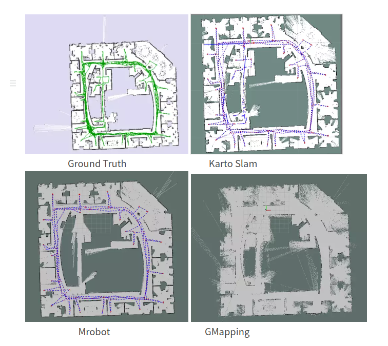
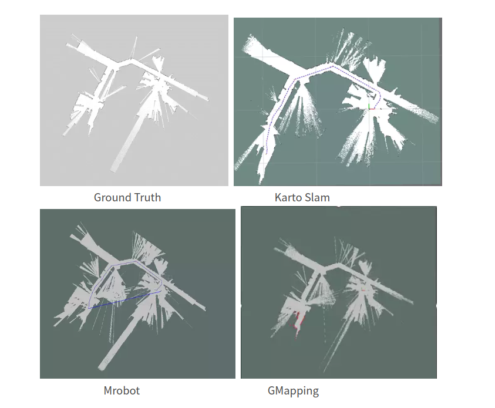
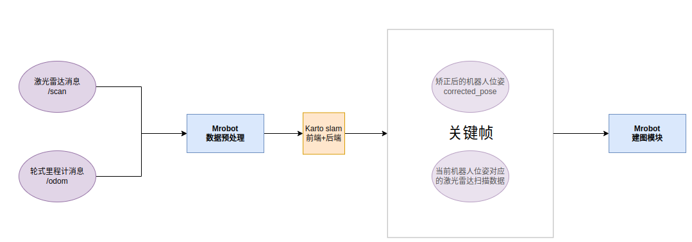

# mrobot

本程序为一套可解耦的SLAM框架，该激光SLAM框架主要分为数据预处理模块、前端里程计模块、后端优化模块、回环检测模块以及建图模块。

## 0.前言

出于对激光SLAM可扩展性的考虑，对激光SLAM框架进行重构。程序整体的设计目的在于尽可能保留充足的可扩展性，各模块充分解耦、即插即用，做到程序二次开发简便、可扩展性高。

## 1.简介

本套激光SLAM程序采用基于相关方法的匹配方法，在后端和回环部分使用图优化进行位姿的优化，在建图部分可选择计数建图、覆盖栅格建图算法等。

功能：完成定位与建图功能

部署前需要自行准备并更改的有：

- 含有激光雷达扫描数据(scan)和里程计信息的bag包
- 各坐标系名称，如激光雷达坐标系、里程计坐标系等。
- 激光雷达数据的话题名称
- 建图算法相关的参数配置

## 2.环境配置

- Ubuntu20.4 LTS

- GCC 9.3.0

- ros-noetic

- Eigen3

  

## 3.工作空间创建与运行

### 3.1创建catkin工作空间

```
mkdir -p ~/mrobot_ws/src
cd ~/mrobot_ws/src
```

### 3.2下载功能包源码

```
git clone https://github.com/ros-perception/open_karto.git
git clone https://github.com/ros-perception/sparse_bundle_adjustment.git
git clone https://github.com/Billy2001-shadow/mrobot_frame_ws.git
```

### 3.3编译catkin工作空间

```
cd ~/mrobot_ws/
catkin_make -j6
```

### 3.4运行SLAM建图程序

```
source ./devel/setup.bash
roslaunch mrobot_frame mapping.launch 
```


## 4.实验Demo

### 4.1 intel.bag



### 4.2 basic_localization_stage_indexed.bag




## 5.待优化部分

- 核心算法的文件中 太多和Open Karto关联的代码
- 匹配参数文件应该放在哪个文件进行初始化呢
- 选择优化器的代码是否可以放在后端和回环部分呢
- 显示前端位姿部分的代码目前有点问题(首尾相接问题)
- 保存栅格地图部分的代码


目前的程序框架，需要进一步解耦




## Reference

[Karto_slam](https://github.com/ros-perception/open_karto.git)

[从零开始搭二维激光SLAM](https://github.com/xiangli0608/Creating-2D-laser-slam-from-scratch)


